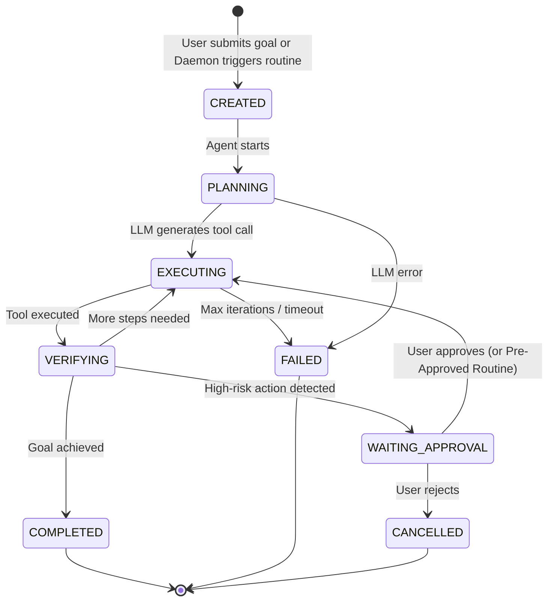

<div align="center">

# 🛰️ Relay

### Your Autonomous Personal AI Agent

[](https://www.typescriptlang.org/)
[](https://reactnative.dev/)
[](https://expo.dev/)
[](https://fastify.dev/)
[](https://firebase.google.com/)
[](LICENSE)

**Relay** is an autonomous AI agent that acts on your behalf — making phone calls, sending emails, scheduling meetings, ordering food, managing tasks, and more — all through natural language.

Speak or type a goal → Relay plans, executes, asks for approval when needed, and delivers results.

[Getting Started](#-getting-started) · [Architecture](#-architecture) · [Features](#-features) · [API Reference](#-api-reference) · [Contributing](#-contributing)

</div>

---

## ✨ What Can Relay Do?

> *"Call Mom to say I'll be late for dinner"*
> *"Find 30m with Rahul on Tuesday afternoon and send a calendar invite"*
> *"Order a cold coffee under ₹150 from Zomato"*
> *"Check my unread emails from the team and summarize them"*
> *"WhatsApp Rahul saying I'll be 10 minutes late"*

Relay takes a high-level goal, decomposes it into steps, executes each step via secure tool calls, pauses for human approval on sensitive actions, and reports back — all autonomously.

---

## 🏗 Architecture

```
┌─────────────────────────────────────────────────────────┐
│                    📱  Mobile App                       │
│           Expo Router · React Native · Zustand          │
│   Voice Input · Task Dashboard · Approval Cards · Live  │
│            Step Trace · Connections · Settings           │
└────────────────────────┬────────────────────────────────┘
                         │  REST API
┌────────────────────────▼────────────────────────────────┐
│                  ⚙️  Backend Service                    │
│              Fastify · TypeScript · Pino                │
│                                                         │
│  ┌──────────────────────────────────────────────────┐   │
│  │           🧠 Agent Orchestrator                  │   │
│  │  Plan → Execute → Verify → Approve → Complete    │   │
│  │                                                  │   │
│  │  ┌────────────┐  ┌──────────────┐  ┌──────────┐  │   │
│  │  │  Planner   │  │ PolicyEngine │  │ Context  │  │   │
│  │  │ (LLM Core) │  │ (Permissions)│  │ Builder  │  │   │
│  │  └──────┬─────┘  └──────────────┘  └──────────┘  │   │
│  │         │                                         │   │
│  │  ┌──────▼──────────────────────────────────────┐  │   │
│  │  │         AI Provider Abstraction             │  │   │
│  │  │  Groq (Llama 3.3) · Gemini · Claude · Mock │  │   │
│  │  └─────────────────────────────────────────────┘  │   │
│  └──────────────────────────────────────────────────┘   │
│                                                         │
│  ┌──────────────────────────────────────────────────┐   │
│  │              🔧 Tool Registry (21 tools)         │   │
│  │                                                  │   │
│  │  📧 Gmail        📅 Calendar     📞 Telephony   │   │
│  │  💬 WhatsApp     📱 SMS          👤 Contacts    │   │
│  │  🍕 Food Order   🌐 Web Search   📝 Tasks      │   │
│  │  🧠 Memory       🔗 Web Open                    │   │
│  └──────────────────────────────────────────────────┘   │
│                                                         │
│  ┌──────────────┐  ┌──────────────┐  ┌──────────────┐   │
│  │  🔐 Security │  │  🗄️ Database │  │ 🔑 Google   │   │
│  │  Injection   │  │  Firestore / │  │   OAuth2     │   │
│  │  Guard + Arg │  │  In-Memory   │  │ Integration  │   │
│  │  Validation  │  │  Fallback    │  │              │   │
│  └──────────────┘  └──────────────┘  └──────────────┘   │
└─────────────────────────────────────────────────────────┘
```

### Monorepo Structure

```
relay/
├── apps/
│   └── mobile/                # React Native + Expo mobile client
│       ├── app/               # Expo Router screens (home, history, connections, settings)
│       ├── components/        # Reusable UI (VoiceButton, ApprovalCard, StepTrace, etc.)
│       ├── services/          # API client layer
│       └── store/             # Zustand global state management
│
├── services/
│   └── backend/               # Fastify API server + AI agent engine
│       ├── src/
│       │   ├── agent/         # Orchestrator, Planner, Context, AI Providers
│       │   ├── api/           # REST route handlers (tasks, voice, approvals, etc.)
│       │   ├── database/      # Firestore + in-memory DB adapters
│       │   ├── integrations/  # Google OAuth2 integration
│       │   ├── permissions/   # Deterministic policy engine for risk-based approvals
│       │   ├── security/      # Prompt injection guard + argument validation
│       │   └── tools/         # All 21 tool implementations
│       └── test/              # Unit, integration, and E2E test suites
│
├── packages/
│   ├── shared-types/          # TypeScript types shared across all packages
│   ├── config/                # Centralized configuration constants
│   └── tool-schemas/          # Zod schemas for tool input/output validation
│
├── package.json               # Root workspace configuration
└── tsconfig.json              # Root TypeScript project references
```

---

## 🚀 Features

### 🧠 Intelligent Agent Core

| Feature | Description |
|---|---|
| **Autonomous Orchestration** | State-machine agent loop: `PLANNING → EXECUTING → VERIFYING → COMPLETED` with automatic guardrails for max iterations and duration |
| **Multi-Provider AI** | Seamlessly switches between **Groq (Llama 3.3 70B)**, **Google Gemini 2.5 Flash**, and **Anthropic Claude 3.5 Sonnet** with automatic fallback |
| **Smart Planning** | LLM generates typed, schema-validated tool calls — not free-text commands |
| **Contextual Memory** | Remembers user preferences (favorite coffee, usual orders) across sessions for personalized execution |
| **Follow-up Conversations** | Maintains multi-turn conversation history within a task for clarifications |

### 🔧 24 Built-in Tools

| Category | Tools | Capabilities |
|---|---|---|
| **📧 Email** | `gmail.searchMessages`, `gmail.readMessage`, `gmail.draftMessage`, `gmail.sendMessage` | Search, read, draft, and send emails via Gmail API |
| **📅 Calendar** | `calendar.findAvailability`, `calendar.listEvents`, `calendar.createEvent`, `calendar.updateEvent`, `calendar.deleteEvent` | Full Google Calendar management with smart scheduling |
| **📞 Communication** | `telephony.makeCall`, `messaging.sendWhatsApp`, `messaging.sendSms` | Native phone calls, WhatsApp and SMS messaging |
| **👤 Contacts** | `contacts.search` | Search synced device contacts and Google contacts |
| **🍕 Food** | `food.searchOptions`, `food.prepareOrder` | Multi-platform search (Zomato, Swiggy, Blinkit, Zepto) with preference memory |
| **🌐 Web** | `web.search`, `web.open` | Web search via Tavily/SerpAPI and page content extraction |
| **📝 Tasks & Routines** | `tasks.create`, `tasks.getStatus`, `tasks.cancel`, `tasks.schedule`, `tasks.listScheduled`, `tasks.cancelScheduled` | Sub-tasks and proactive scheduled routines with cron cadences |
| **🧠 Memory** | `memory.save`, `memory.get` | Persistent user preference storage and retrieval |

### 🔄 Proactive Scheduled & Recurring Routines Engine

| Component | Functionality |
|---|---|
| **Scheduler Daemon** | Persistent background service scanning due routines against current UTC timestamps with in-flight concurrency locks |
| **Timezone-Aware Cron** | Evaluates natural language cadences (*"every weekday at 8:30 AM"*) and 5-part cron expressions relative to user device timezone |
| **Pre-Approved Whitelist** | Prevents approval deadlocks during autonomous runs by bypassing confirmation prompts only for tools pre-approved by the user |
| **Server Catch-Up Window** | 5-minute guard window that skips missed recurring runs after server downtime and safely advances to the next future occurrence |
| **One-Tap Templates** | Quick-start templates for Morning Email Briefings, Dinner Food Reminders, Daily Agenda Prep, and Friday Weekly Recaps |

### 🔐 Security & Permissions

| Layer | Mechanism |
|---|---|
| **Risk-Based Policy Engine** | Every tool is tagged with a risk level (`LOW`, `MEDIUM`, `HIGH`, `CRITICAL`). High-risk actions require explicit user approval or routine whitelist |
| **Prompt Injection Defense** | External content (emails, web pages) is wrapped in `<untrusted_external_content>` tags and treated strictly as data, never as instructions |
| **Schema Validation** | All tool arguments are validated with **Zod** schemas before execution |
| **Argument Sanitization** | Dedicated `validateArgs` security module prevents injection via tool arguments |
| **Token Encryption** | OAuth tokens encrypted at rest with **AES-256-GCM** |

### 📱 Mobile Experience

| Feature | Details |
|---|---|
| **Voice Input** | Speak your goal — transcribed via Groq Whisper and sent to the agent |
| **Routines Dashboard** | Dedicated tab for managing schedules, 1-tap template setups, and immediate "▶️ Run Now" test triggers |
| **Live Step Trace** | Real-time visualization of agent planning and execution steps |
| **Approval Cards** | Rich UI cards for reviewing and approving/rejecting sensitive actions |
| **Task History** | Searchable multi-dimensional history of all past tasks with status and results |
| **Google OAuth** | One-tap connection to Gmail, Calendar, and Contacts directly inside Settings |
| **Dark Mode** | Sleek dark UI optimized for AMOLED displays |

---

## 📦 Tech Stack

| Layer | Technology |
|---|---|
| **Language** | TypeScript 5.7 (strict mode, ES2022) |
| **Mobile** | React Native 0.81 · Expo 54 · Expo Router · Zustand |
| **Backend** | Fastify 5 · Pino logger · Node.js · cron-parser |
| **AI Providers** | Groq SDK (Llama 3.3 70B) · Google Generative AI (Gemini) · Anthropic SDK (Claude) |
| **Database** | Firebase Admin / Firestore (production) · In-Memory DB (development) |
| **Auth & APIs** | Google OAuth2 · googleapis · Firebase Auth · Expo Push API |
| **Validation** | Zod schema validation |
| **Testing** | Jest · ts-jest (unit, integration, E2E) |
| **Monorepo** | npm workspaces with TypeScript project references |

---

## 🏁 Getting Started

### Prerequisites

- **Node.js** ≥ 18.x
- **npm** ≥ 9.x
- **Expo CLI** (`npx expo`)
- **Android/iOS emulator** or physical device with [Expo Go](https://expo.dev/go)

### 1. Clone & Install

```bash
git clone https://github.com/vaibhav-aiml/Relay.git
cd Relay
npm install
```

### 2. Configure Environment

```bash
# Copy the example env files
cp .env.example .env
cp apps/mobile/.env.example apps/mobile/.env
```

Edit `.env` with your API keys:

```env
# AI Providers (at least one required)
GROQ_API_KEY=gsk_...                    # Primary: Llama 3.3 70B
GEMINI_API_KEY=AI...                    # Fallback: Gemini 2.5 Flash
ANTHROPIC_API_KEY=sk-ant-...            # Optional: Claude 3.5 Sonnet

# Google Workspace OAuth2 (for Gmail, Calendar, Contacts)
GOOGLE_CLIENT_ID=...
GOOGLE_CLIENT_SECRET=...

# Firebase (optional — falls back to in-memory DB)
FIREBASE_PROJECT_ID=...
FIREBASE_CLIENT_EMAIL=...
FIREBASE_PRIVATE_KEY=...

# Security
TOKEN_ENCRYPTION_KEY=...                # 32-byte Base64 key for AES-256-GCM

# Web Search (optional)
WEB_SEARCH_API_KEY=...                  # Tavily or SerpAPI
```

### 3. Build Shared Packages

```bash
npm run build
```

### 4. Start the Backend & Scheduler Daemon

```bash
npm run dev:backend
# → Server running on http://localhost:4000
# → Scheduler daemon running background evaluations
# → Health check: GET http://localhost:4000/health
```

### 5. Start the Mobile App

```bash
npm run dev:mobile
# → Opens Expo DevTools
# → Scan QR with Expo Go or press 'w' for Web / 'a' for Android / 'i' for iOS
```

---

## 🔌 API Reference

All endpoints are prefixed with `/api`.

| Method | Endpoint | Description |
|---|---|---|
| `GET` | `/health` | Health check with provider & database status |
| `POST` | `/api/tasks` | Create and execute a new agent task |
| `GET` | `/api/tasks/:id` | Get task status and execution trace |
| `POST` | `/api/approvals/:taskId` | Submit approval/rejection for a pending action |
| `GET` | `/api/schedules` | List user scheduled routines with status filters |
| `POST` | `/api/schedules` | Create a new scheduled or recurring routine |
| `GET` | `/api/schedules/:id` | Get details for a specific scheduled routine |
| `PUT` | `/api/schedules/:id` | Update schedule goal, cadence, or pre-approved permissions |
| `POST` | `/api/schedules/:id/toggle` | Toggle routine status between active and paused |
| `POST` | `/api/schedules/:id/run` | Manually trigger an immediate execution of a routine |
| `DELETE` | `/api/schedules/:id` | Delete/cancel a scheduled routine |
| `POST` | `/api/schedules/push-token` | Register device Expo push token and timezone |
| `POST` | `/api/voice/transcribe` | Transcribe audio to text (multipart upload, 25MB max) |
| `GET` | `/api/connections/google/auth-url` | Get Google OAuth2 authorization URL |
| `GET` | `/api/connections/google/callback` | OAuth2 callback handler |
| `GET` | `/api/memory` | Retrieve stored user preferences |
| `POST` | `/api/memory` | Save a user preference |
| `POST` | `/api/contacts/sync` | Sync device contacts to the backend |
| `GET` | `/api/contacts/search` | Search synced contacts |

---

## 🧪 Testing

The project includes comprehensive test suites at three levels:

```bash
# Run all tests
npm test

# Unit tests only (Scheduler, Cron, Tools, Policies, Security)
npm run test:unit

# Integration tests (REST API lifecycle, Orchestrator)
npm run test:integration

# End-to-end scenario tests
npm run test:e2e
```

---

## 🔄 Agent Execution Flow



---

## 🗺️ Roadmap

- [x] 🔄 Recurring scheduled tasks & autonomous routines engine
- [x] 🔐 Pre-approved tool whitelisting for autonomous executions
- [x] 🍕 AI food ordering with multi-platform comparison & preference memory
- [x] 💬 WhatsApp, SMS, and native telephony calling integration
- [x] 📅 Google Workspace Gmail & Calendar full lifecycle
- [ ] 🔔 Push notifications for urgent approval requests
- [ ] 🌍 Multi-language voice support
- [ ] 🏠 Smart home integrations (IoT)
- [ ] 📊 Task analytics dashboard
- [ ] 🤖 Multi-agent collaboration
- [ ] 🧩 Plugin system for community tools


---

## 🤝 Contributing

Contributions are welcome! Here's how to get started:

1. **Fork** this repository
2. **Create** a feature branch: `git checkout -b feat/your-feature`
3. **Commit** your changes: `git commit -m 'feat: add your feature'`
4. **Push** to the branch: `git push origin feat/your-feature`
5. **Open** a Pull Request

Please follow [Conventional Commits](https://www.conventionalcommits.org/) for commit messages.

---

## 📄 License

This project is licensed under the **MIT License** — see the [LICENSE](LICENSE) file for details.

---

<div align="center">

**Built with ❤️ by [Vaibhav](https://github.com/vaibhav-aiml)**

⭐ Star this repo if Relay made your life easier!

</div>
